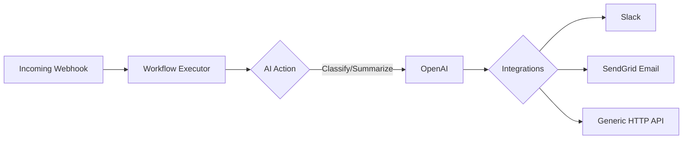

# FastAPI Workflow Engine

An intelligent, asynchronous workflow engine built with FastAPI, PostgreSQL, and Redis. It allows you to build dynamic workflows combining AI tasks (like classification and summarization) with external integrations (like Slack, Email, and HTTP requests) triggered seamlessly via Webhooks.

## Architecture Flow



## Setup & Environment Variables

Untuk keamanan, **kunci API tidak boleh ditulis secara permanen ke dalam file kode atau `docker-compose.yml`**, agar tidak terekspos ke publik saat di-*push* ke GitHub.

Cara yang aman untuk menjalankannya: Cukup buat sebuah file bernama `.env` di folder proyek Anda (sejajar dengan `docker-compose.yml`), lalu isi dengan baris ini:

```text
OPENAI_API_KEY=sk-kunci-api-rahasia-anda
```

Docker secara otomatis akan membaca file `.env` ini saat Anda menjalankan `docker-compose up -d`, tanpa pernah menyimpannya ke GitHub karena sudah diabaikan di `.gitignore`.

## Quickstart

To run the project locally with the default seeded data, simply use docker-compose:

```bash
docker-compose up -d --build
```

## Triggering a Webhook

You can trigger the demo Lead Triage workflow using the following `curl` command. Note: if you have set `WEBHOOK_SECRET` in your `.env`, you must supply a valid HMAC signature. If testing without verification, you can comment out the signature check or leave the secret empty.

```bash
curl -X POST "http://localhost:8000/api/v1/webhooks/1/trigger" \
     -H "Content-Type: application/json" \
     -d '{
         "name": "Budi",
         "email": "budi@example.com",
         "message": "I am interested in your Enterprise plan."
     }'
```
